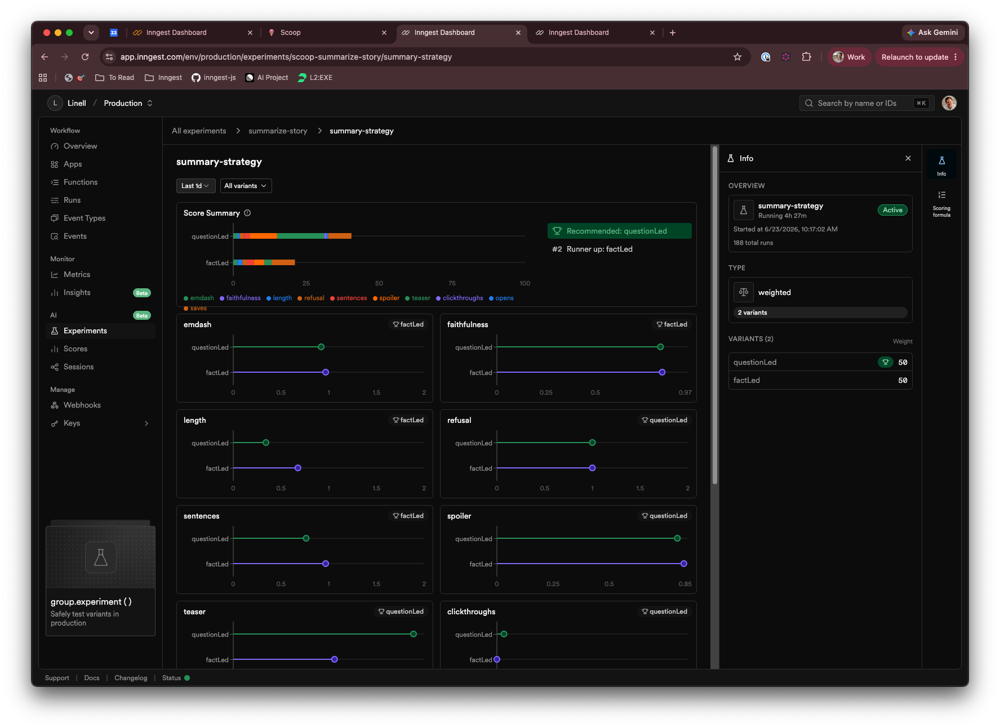

# Scoop

Scoop is an ice-cream-themed RSS reader with an "Ask Scoop" chatbot. It's a
real, working app that also happens to be a hands-on tour of Inngest's
**scoring, experiments, and sessions**, with everything scored live in the same
system that runs the pipeline.

It's built around a question you can't answer with a single metric:

> A good summary (a "scoop") has to do two things that pull against each other:
> stay **faithful** to the article, and tease well enough to make you **click
> through**. Push on one and you lose the other. So which writing strategy wins?

Every story is summarized by an A/B experiment, `summary-strategy`, that serves
one of two strategies per story on a 50/50 split:

- **`questionLed`** opens with a curiosity-gap question the story answers.
- **`factLed`** leads with the most striking fact, then frames why it matters.

Scoop scores both variants live, from grammar all the way out to whether a
reader actually clicked through, and lets the experiment dashboard say which one
to ship.

Vocabulary: feeds are **flavors**, summaries are **scoops**, the chatbot is
**Ask Scoop**, and cited links are **worth a click**.

## What we score (and why one number won't do)

Every score is attributed to the variant that produced the summary, so the
dashboard can slice each signal by strategy. They come in four families:

| Family | Scores | Written by | Signal |
| --- | --- | --- | --- |
| **Guardrails** | `length`, `emdash`, `sentences`, `refusal` | `summarize-story`, inline | Cheap deterministic checks: is the summary even well-formed? |
| **Judge** | `faithfulness`, `teaser`, `spoiler` | `judge-summary` (deferred) | A model grades the summary against the article (`spoiler`: high is bad). |
| **Engagement** | `opens`, `clickthroughs`, `saves` | `score-click`, `score-save` | What readers *did*: viewed in-app, clicked out to the source, saved for later. |
| **Human** | `satisfaction` | `score-rating` | The reader's own verdict: good, oversold, or spoiled. |

The guardrails run inline and the judge runs deferred, but the engagement and
human signals are the interesting case. They land later, as their own
event-driven runs, long after the summary was written and with no link back to
it. Scoop handles that by persisting the summarize run's id alongside the
summary and re-attributing each of those scores to its variant, so a click that
happens hours later still counts for the right strategy. That's the jump from
scoring a generation to scoring an outcome.

## Sessions: fidelity into when and where

Scoring tells you *which variant* won. Sessions tell you *what happened around*
each signal, by grouping runs that would otherwise look unrelated:

- **`browse_session`** gathers one tab's burst of activity (a click, a rating, a save).
- **`conversation_id`** ties an outbound click back to the Ask Scoop turn that drove it.
- **`client_id`** follows a returning visitor over time.

Sessions don't do any of the scoring math. They're the observability layer that
turns a number on the dashboard into a story you can actually read.

## What the experiment found

The two strategies split almost perfectly along the tension Scoop was built to
expose:

- **`factLed` wins on fidelity.** It scores 0.97 on `faithfulness` against
  questionLed's 0.83, and takes the length, sentences, and emdash guardrails
  too. It writes the more complete, accurate summary.
- **`questionLed` wins on everything that matters.** It's the better `teaser`,
  gives away less as a `spoiler`, and sweeps the outcomes that count
  (`clickthroughs`, `opens`, `saves`), where `factLed` barely registers.



The dashboard recommends `questionLed`, and that's the whole reason to score
more than one signal. If you'd graded only the judge's `faithfulness`, you'd
have shipped `factLed`: the more faithful summary that nobody clicks, because it
reads as a replacement for the article instead of a reason to open it. Only the
engagement signals, tied back across runs, show that the less faithful summary
is the one that actually works.

And because the scoring runs online, the verdict isn't frozen. The experiment
keeps grading every new story, so if `factLed` starts pulling ahead as the feed
shifts, the dashboard will show it on its own with no code change. The natural
next step is to ask a sharper question: split the experiment by story type, for
instance, to learn whether a breaking-news item and a long read each call for a
different kind of teaser.

## Stack

TanStack Start + React 19 on Cloudflare Workers, Inngest for the durable
ingest/summarize/score pipeline, D1 for the shared story catalog (`localStorage`
holds a user's subscribed flavors, no auth), Tailwind v4 + shadcn/ui, Biome,
Vitest, and Claude for summaries, the judge, and chat.

## Architecture

- `src/routes` - file-based routes: `/` (feed), `/chat`, `/story/$storyId`, `/saved`, `/l/$slug` (shared list), `/about`, `/r/$storyId` (click tracker that fires `scoop/story.clicked` before redirecting), `/api/inngest`
- `src/inngest` - client, events, and functions: `refresh-feeds` (cron), `refresh-feed`, `summarize-story` (declares the experiment), `resummarize-story`, and the scorers `judge-summary`, `score-click`, `score-save`, `score-rating`
- `src/server` - D1 access, feed queries, RSS parsing, article extraction, summarization, the judge, and chat
- `src/lib` - shared helpers (parsing, URL hashing, subscriptions hook); `migrations` - D1 schema

Stories are deduped by a hash of their normalized URL, and each new story fans
out its own `summarize-story` run, which serves a variant and seeds its scores.

## Local development

Copy `.dev.vars.example` to `.dev.vars` and fill in your keys, then:

```bash
npm install
npx wrangler d1 migrations apply scoop --local
npm run dev                 # app on http://localhost:3000
npx inngest-cli@latest dev  # Inngest Dev Server, auto-discovers /api/inngest
```

Other scripts: `npm run build`, `npm run test`, `npm run check` (Biome), `npm run deploy`.

## Deploy

Runs as the Cloudflare Worker `scoop`, push-to-deploy via Workers Builds on `main`.

- Apply schema changes to prod: `npx wrangler d1 migrations apply scoop --remote` (Workers Builds does not run migrations automatically)
- Set secrets with `wrangler secret put`: `ANTHROPIC_API_KEY`, `OPENAI_API_KEY`, and `INNGEST_SIGNING_KEY` + `INNGEST_EVENT_KEY` from Inngest Cloud's production environment. Do not set `INNGEST_DEV` in production.
